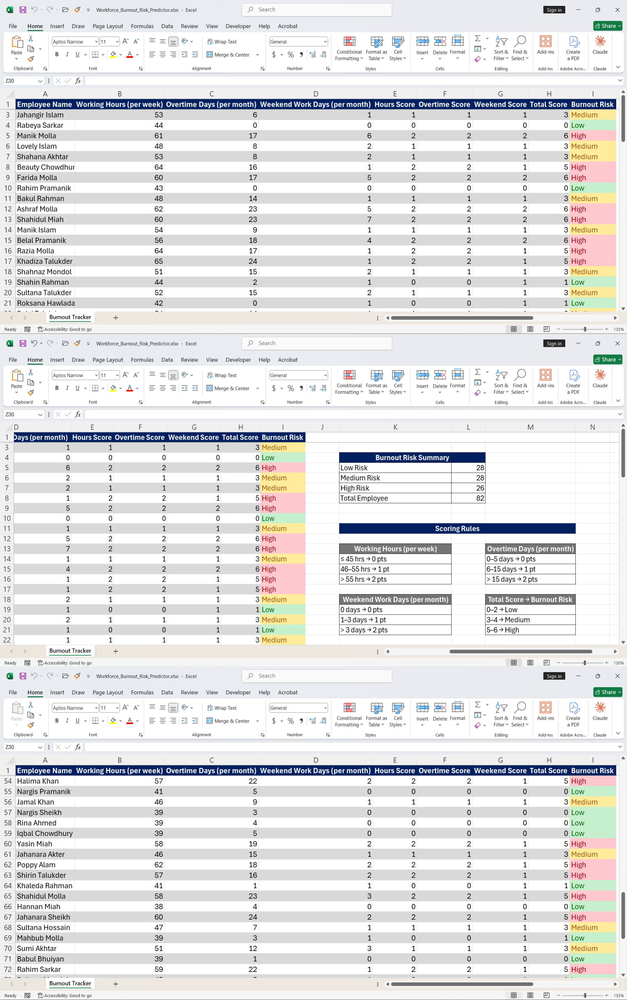

# 🔥 Workforce Burnout Risk Predictor — Excel Project   

A formula-based Excel tool that predicts employee burnout risk — Low, Medium, or High — using three measurable inputs: working hours, overtime days, and weekend work days. Every score and risk label is calculated purely through nested Excel formulas, with zero manual judgment involved.    

---

## 📌 Project Overview

Burnout is usually noticed only after it becomes a problem — by then, an employee may already be disengaged or close to resigning. This project simulates an early-warning system that HR teams could use to flag at-risk employees automatically, based purely on objective work pattern data rather than subjective manager opinion.   

The dataset covers 82 employees with realistic Bangladeshi names, each scored across three burnout indicators and assigned a final risk level — instantly visible through conditional formatting.   

---

## 🖼️ Preview

---

## 📊 Burnout Risk Summary   

| Risk Level | Employee Count |
|------------|-----------------|
| 🟢 Low Risk | 28 |
| 🟡 Medium Risk | 28 |
| 🔴 High Risk | 26 |
| **Total Employees** | **82** |

A near-even three-way split across the workforce — meaning roughly 1 in 3 employees is currently flagged as High Risk, a strong signal for HR intervention if this were a real organization. 

---

## 🧮 How the Scoring Logic Works   

Each employee is scored across three categories using nested `IF` formulas. The three category scores are added together into a **Total Score (max 6)**, which then determines the final **Burnout Risk** label.   

### Working Hours (per week)   
| Range | Points |
|-------|--------|
| ≤ 45 hrs | 0 pts |
| 46–55 hrs | 1 pt |
| > 55 hrs | 2 pts |

### Overtime Days (per month)   
| Range | Points |
|-------|--------|
| 0–5 days | 0 pts |
| 6–15 days | 1 pt |
| > 15 days | 2 pts |

### Weekend Work Days (per month)   
| Range | Points |
|-------|--------|
| 0 days | 0 pts |
| 1–3 days | 1 pt |
| > 3 days | 2 pts |

### Final Burnout Risk (Total Score → Risk Level)   
| Total Score | Risk Level |
|--------------|------------|
| 0–2 | 🟢 Low |
| 3–4 | 🟡 Medium |
| 5–6 | 🔴 High |

All thresholds are documented directly on the sheet in an on-sheet **"Scoring Rules"** legend — so anyone opening the file can verify the logic without needing to inspect a single formula.

---

## 🔍 Sample Data Snapshot   

| Employee Name | Working Hours | Overtime Days | Weekend Days | Total Score | Burnout Risk |
|----------------|----------------|-----------------|----------------|---------------|----------------|
| Manik Molla | 61 | 17 | 6 | 6 | 🔴 High |
| Rabeya Sarkar | 44 | 0 | 0 | 0 | 🟢 Low |
| Shahidul Miah | 60 | 23 | 7 | 6 | 🔴 High |
| Shahin Rahman | 44 | 2 | 1 | 1 | 🟢 Low |
| Lovely Islam | 48 | 8 | 2 | 3 | 🟡 Medium |

> The full dataset spans 82 employees and is available in
> `custom_dataset_burnout_risk_82.csv` for anyone who wants to explore or
> re-run the analysis independently.

---

## 🛠️ Features Built   

| Feature | Purpose |
|---------|---------|
| Nested `IF` Formulas | Calculates Hours Score, Overtime Score, Weekend Score, and final Burnout Risk |
| Conditional Formatting | Green/Yellow/Red color-coding on the Burnout Risk column for instant visual scanning |
| `COUNTIF`-based Summary Dashboard | Live count of Low/Medium/High risk employees plus total headcount |
| On-Sheet Scoring Rules Legend | Documents every threshold transparently, right next to the data |
| Frozen Header Row | Keeps column headers visible while scrolling through all 82 rows |
| Table Formatting | Clean, readable layout designed for scanning large employee lists |

---

## 💡 Key Learnings   

- How to convert three separate behavioral indicators into a single, unified risk score using consistent point-based logic   
- Building nested `IF` formulas that stay readable even as the number of conditions grows   
- Using `COUNTIF` to turn raw row-level data into a live, always-accurate summary dashboard   
- Designing for transparency — embedding the scoring rules directly in the sheet so the logic isn't a "black box" to whoever opens it   
- Applying conditional formatting purposefully, so risk levels are scannable at a glance across a large dataset rather than requiring row-by-row reading   

---

## 🚀 How to Use   

1. Download the `Workforce_Burnout_Risk_Predictor.xlsx` file   
2. Open it in Microsoft Excel   
3. Add a new employee row with their Working Hours, Overtime Days, and Weekend Work Days   
4. The Hours Score, Overtime Score, Weekend Score, Total Score, and Burnout Risk columns will calculate and color-code automatically   
5. Check the **Burnout Risk Summary** table for an instant organization-wide overview   

---

## 👤 Author

**Md. Sirajul Islam**   
- [linkedin.com/in/md-sirajul-islam57](https://linkedin.com/in/md-sirajul-islam57)   
- [github.com/sirajul-islam5](https://github.com/sirajul-islam5)   

---

## 📄 License   

This project is open source and available under the [MIT License](LICENSE).   

---

> *This is a self-driven project created for learning purpose. All employee names and data are synthetically generated and do not represent real individuals.*   
